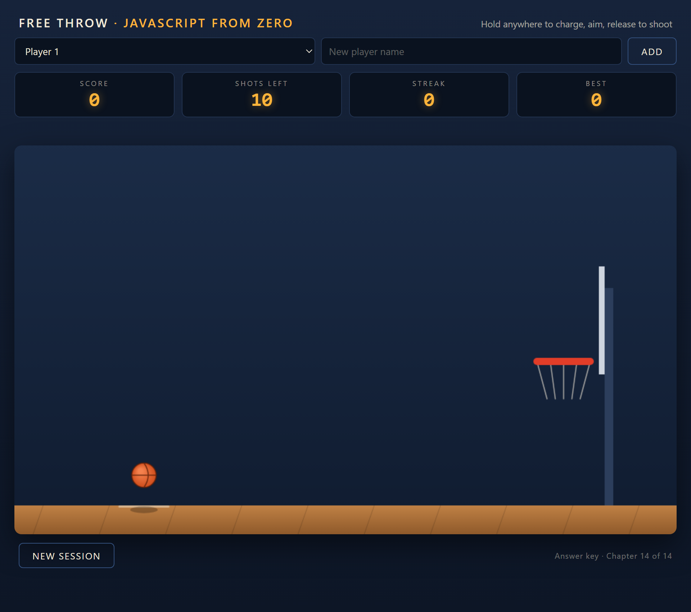

# Capítulo 0 - Antes de Empezar

*Léelo en: [English](README.md) | **Español***

¡Bienvenido! Antes de escribir una sola línea de código, este capítulo corto te muestra a dónde vas, qué necesitas (spoiler: casi nada), y cómo funciona el curso. Diez minutos aquí te ahorrarán horas después.

## Lo que vas a construir

Al terminar este curso habrás construido - y entendido, línea por línea - este juego:

Es un juego 2D de tiros libres de baloncesto que corre **en el navegador**:

- **Tiro con carga sostenida** - mantén presionado en cualquier parte de la cancha: una barra de potencia se llena de verde a rojo mientras una vista previa punteada de la trayectoria crece en vivo con tu carga. Apunta con el puntero. Suelta para tirar.
- **Física real** - la pelota sigue un arco de gravedad, rebota en el tablero, repiquetea en el aro, y rebota en cada pared de un gimnasio cerrado. Nunca sale del cuadro, y tu siguiente tiro empieza donde se detuvo.
- **Puntuación** - el juego detecta canastas limpias, hace brillar el aro en celebración, y actualiza un marcador estilo LED.
- **Sesiones y jugadores** - 10 tiros por sesión, resultados al final, y perfiles de jugador cuya mejor racha y mejor sesión sobreviven al cierre del navegador.

Tres tecnologías hacen que esto funcione - y las tres ya las tienes:

| Tecnología | Qué es | Su papel en nuestro juego |
|---|---|---|
| **JavaScript** | El lenguaje de programación integrado en todo navegador | Cada línea de la lógica del juego |
| **Canvas 2D** | Un elemento de HTML sobre el que JavaScript puede dibujar, píxel por píxel | La cancha, la pelota, la red - cada cuadro que ves |
| **El navegador** | El motor que ya tienes instalado | Ejecuta el código, dibuja los píxeles, captura tu entrada, guarda tus récords |

Esa tercera fila es el giro de este curso, y merece un momento.

## El giro: no hay toolchain

Este curso tiene un hermano: [**Rust + Bevy: De Principiante a Ingeniero**](https://github.com/mondragon-developer/rust_bevy_from_beginner_to_engineer) - el *mismo* juego de baloncesto, construido en Rust con el motor de juegos Bevy y compilado a WebAssembly. Su Capítulo 1 instala cerca de **10 GB** de herramientas: un compilador, herramientas de build, un target de WASM, un bundler. Eso es normal en la programación de sistemas, y aquel curso lo dice con honestidad.

El Capítulo 1 de este curso instala un **editor de texto**. Eso es todo. Sin compilador - el navegador lee JavaScript directamente. Sin gestor de paquetes, sin librerías, sin paso de compilación. El juego terminado es **un solo archivo HTML** que puedes abrir, leer y compartir. Cuando algo es así de directo, cada minuto se invierte en aprender el oficio de verdad: programar.

Si tomas ambos cursos, verás el mismo juego resuelto por dos lenguajes muy distintos - una de las comparaciones más instructivas que un programador puede vivir.

## Para quién es este curso

**Principiantes absolutos.** No necesitas saber JavaScript. No necesitas haber escrito código nunca. Si ya has programado, los primeros capítulos serán lectura rápida y los últimos igual se ganarán su lugar.

El título dice "a ingeniero" y lo dice en serio: los primeros capítulos te llevan de la mano por tus primeras variables, y los últimos cubren lo que hacen los desarrolladores profesionales - arquitectura (clases, principios SOLID), una máquina de estados, manejo elegante de errores, un arnés de verificación, y un despliegue real a una URL pública. Absorberás hábitos profesionales *usándolos* en un proyecto real, nunca a través de sermones.

## Cómo funciona el curso

**Cada carpeta de capítulo contiene la lección y un snapshot completo y ejecutable del proyecto tal como existe al final de ese capítulo** (a partir del Capítulo 2). Si tu código se rompe y no encuentras por qué, compáralo contra la carpeta `snapshot/` del capítulo - o copia el snapshot y sigue desde ahí. Nunca puedes quedar atorado para siempre. Como bono, la *diferencia* entre dos snapshots consecutivos es exactamente lo que ese capítulo enseñó.

Mientras lees, verás cuatro tipos de cajas de aviso:

> [!NOTE]
> **Apunte de JavaScript.** Cajas como esta explican un concepto del lenguaje - variables, funciones, clases - en el momento exacto en que el código del juego lo usa por primera vez, normalmente con una metáfora que lo hace memorable. Nada de teoría antes de necesitarla.

> [!WARNING]
> **Solución de problemas.** Cajas como esta describen un error *real*, con el mensaje *real* que verás en la consola y su solución. Cada uno de estos ocurrió construyendo este curso - rompimos el código a propósito para que tengas la respuesta esperándote.

> [!TIP]
> **Los consejos** son atajos opcionales y mejoras de calidad de vida.

> [!IMPORTANT]
> **Las cajas importantes** no son opcionales - versiones fijadas y pasos que rompen todo si se saltan.

### Por qué el código está en inglés (en ambas ediciones del curso)

Cada capítulo de este curso existe en inglés y en español - pero el *código y sus comentarios permanecen en inglés en ambos*. Es deliberado, y es un regalo, no una limitación: todo el mundo de la programación - la documentación, los mensajes de error, Stack Overflow, el código abierto, las entrevistas de trabajo - funciona con identificadores en inglés. `ball.launch()` es lo que leerás y escribirás el resto de tu carrera; `pelota.lanzar()` solo existiría en este curso. Aprender el vocabulario real desde el primer día significa que todo lo que aprendas aquí se transfiere a todas partes.

## Lo que necesitas

### Una computadora

- **Sistema operativo**: Windows, macOS o Linux - cualquiera que corra un navegador moderno. Las capturas del curso son de Windows 11.
- **Espacio en disco**: unos **50 MB libres** - para el caché de VS Code, más que nada. (El curso hermano de Rust pide ~10 GB. Tenemos permiso de disfrutarlo.)
- **Memoria**: si tu computadora puede abrir una pestaña del navegador, puede correr este curso.
- **Internet**: se necesita una vez, para descargar VS Code (~100 MB de descarga).

### Un navegador

Cualquier navegador moderno funciona. Aquel en el que cada capítulo de este curso fue **verificado** está fijado abajo.

### Un editor

Usamos **Visual Studio Code** (gratuito) con la extensión **Live Server**, y eso es lo que verás en cada captura. Live Server refresca el navegador automáticamente cada vez que guardas - un ciclo de retroalimentación tan corto que acelera el aprendizaje. **Pero cualquier editor funciona.** Si ya tienes un favorito, quédatelo.

> [!IMPORTANT]
> **Versiones fijadas (Promesa 3).** En JavaScript no hay muro de versiones de compilador - pero "sin toolchain" no justifica decir "la última versión". Estas son las versiones exactas con las que este curso fue construido y verificado:
>
> | Herramienta | Versión | Rol |
> |---|---|---|
> | Google Chrome | **150.0.7871.102** | Cada snapshot de capítulo fue cargado y jugado ahí |
> | Node.js | **v24.11.1** | Ejecuta el arnés de verificación del curso - opcional hasta el Capítulo 14, donde construyes uno tú mismo |
>
> El juego usa solo APIs estandarizadas desde hace años (Canvas 2D, Pointer Events, localStorage), así que cualquier navegador actual debería comportarse idéntico - pero *verificado* significa verificado, y ese navegador es Chrome 150.

### Lo que *no* necesitas

- ❌ Conocimiento previo de JavaScript (ni de programación)
- ❌ Un compilador, gestor de paquetes, framework o librería alguna - cero
- ❌ Matemáticas más allá de la aritmética - la pizca de matemática vectorial del Capítulo 9 se introduce desde cero absoluto, en una caja opcional de profundización
- ❌ Una PC gamer - este juego 2D corre en lo que sea

## Vocabulario

| English | Español |
|---|---|
| browser | navegador |
| code | código |
| file | archivo |
| toolchain | cadena de herramientas |
| snapshot | instantánea / copia del proyecto |
| deploy | despliegue / publicación |

## Lista de verificación antes del Capítulo 1

- [ ] Tengo un navegador y ~50 MB de espacio libre en disco (saboréalo)
- [ ] Elegí un editor (VS Code si tengo dudas)
- [ ] Entiendo que cada capítulo tiene un snapshot ejecutable al cual recurrir
- [ ] Sé por qué el código estará en inglés, incluso en la edición en español

## Lo que sigue

En el **Capítulo 1** montarás tu kit completo de herramientas - VS Code, la extensión Live Server, y la consola de DevTools del navegador - y conocerás la herramienta de depuración más importante que usarás en tu vida. Es el capítulo de instalación más corto que leerás jamás, y ese es justamente el punto.

**[Continúa al Capítulo 1: Tu kit de herramientas →](../01-your-toolkit/README.es.md)**
